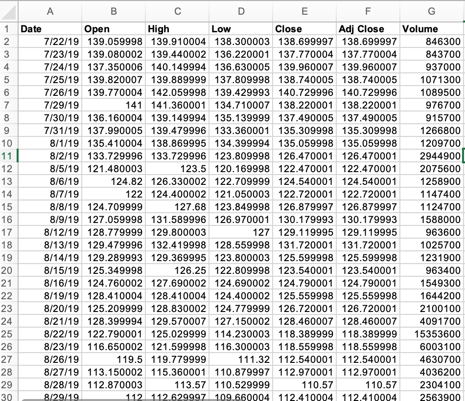
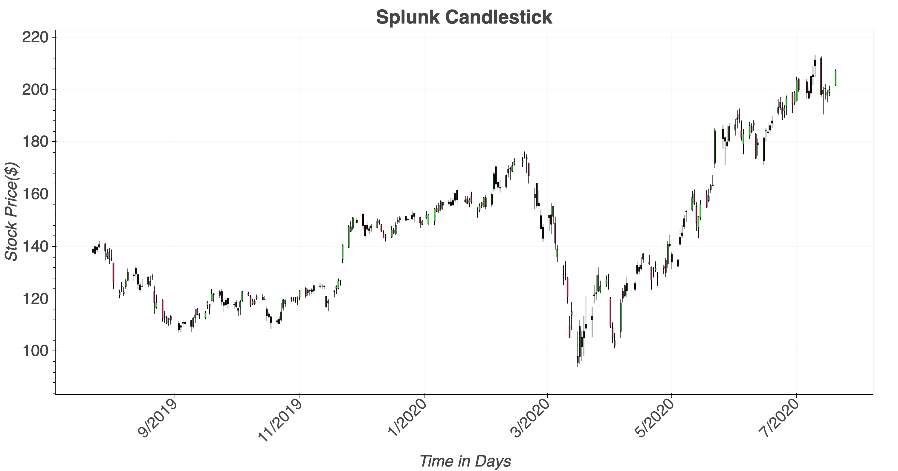
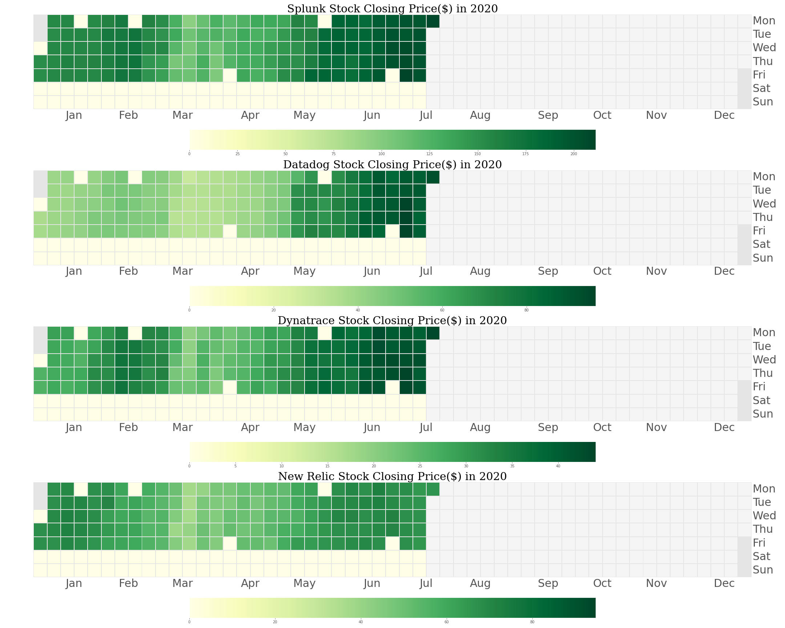
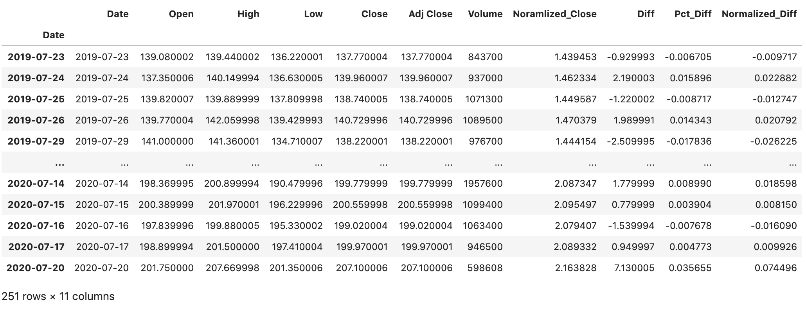
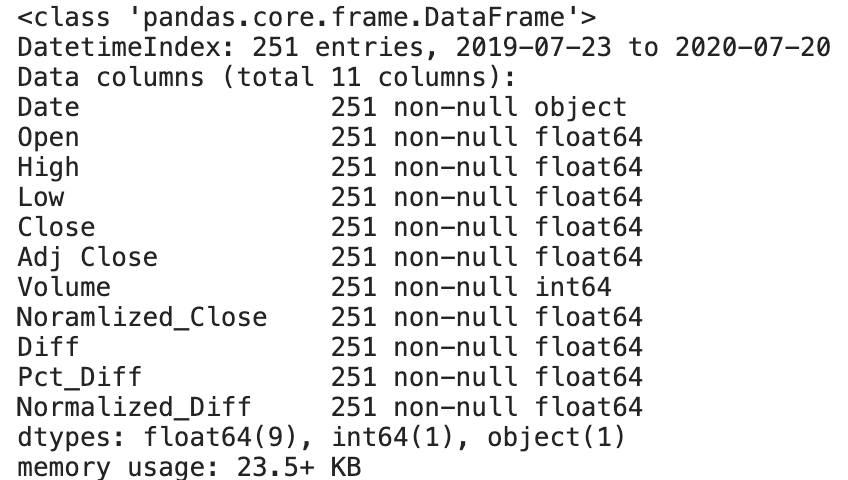
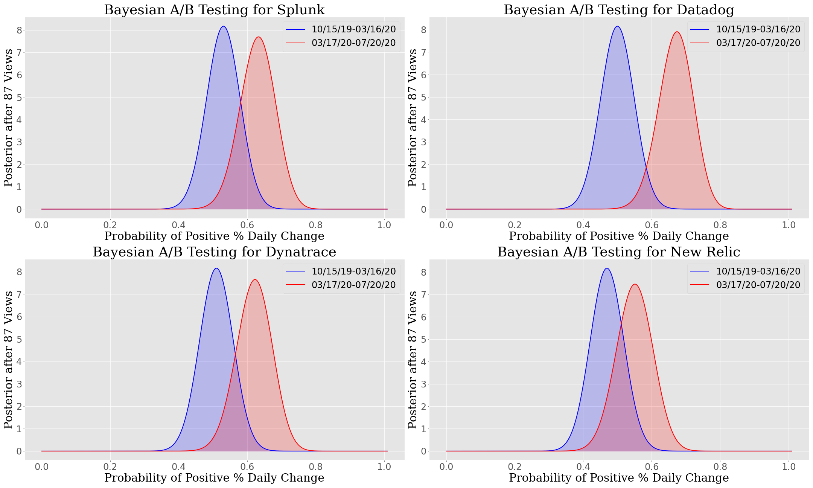
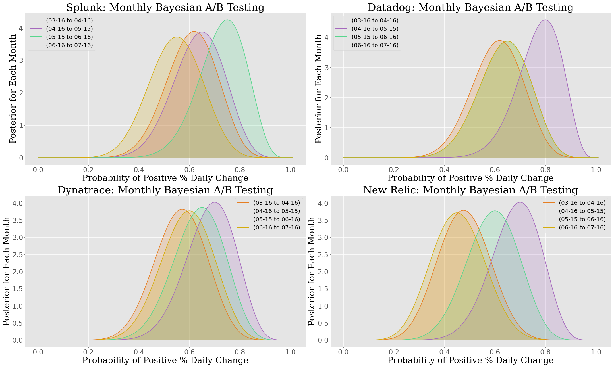

# Statistical Assessment of the Impact of Covid-19 on the Stock Performances for Four Large Application Monitoring Companies 

## Objective

This capstone aims to analyze the relative stock performances of four large application monitoring companies ([Splunk](https://www.splunk.com/), [Datadog](https://datadoghq.com), [New Relic](https://newrelic.com/), [Dynatrace](https://www.dynatrace.com/)) and explore who is gaining most as we are adjusting to the post-covid world. 


## Introduction

Internet service disruptions, especially site loading delays, 404 erros and others, are a major issue for consumes and enterprises, alike.  With increased footprint of online workplace following <b>Covid</b>, service disruptions have become more frequent and longer. It seems the service monitoring companies are benefiting from this trend, going by their stock performances ([Splunk Stock](https://www.google.com/search?tbm=fin&sxsrf=ALeKk02Uh5eiv9qdTCusgE160E8P5bGsWw:1595479080419&q=NASDAQ:+SPLK&stick=H4sIAAAAAAAAAONgecRowS3w8sc9YSn9SWtOXmPU5OIKzsgvd80rySypFJLmYoOyBKX4uXj10_UNDZOSTc0LcuPNeRax8vg5Brs4BlopBAf4eAMA3qoDpUwAAAA&sa=X&ved=2ahUKEwj3t9bexuLqAhXlLX0KHcnnDkYQ3ecFMAB6BAgvEBM&biw=1920&bih=969#scso=_LRQZX7m-EYq10PEP-ZqbmAk1:0), [Datadog Stock](https://www.google.com/search?tbm=fin&sxsrf=ALeKk00Ihr9BF2iwnPYR-HqMNTVyx-xqMQ:1595036432459&q=NASDAQ:+DDOG&stick=H4sIAAAAAAAAAONgecRowS3w8sc9YSn9SWtOXmPU5OIKzsgvd80rySypFJLmYoOyBKX4uXj10_UNDTNSKpMsyo0reRax8vg5Brs4BlopuLj4uwMAvo1YEEwAAAA&sa=X&ved=2ahUKEwjejdff1dXqAhX5CTQIHYeeCUcQ3ecFMAB6BAgnEBM&biw=1920&bih=969&dpr=2#scso=_KlMSX_WfFJ2_0PEP_rSr2Ak1:0&wptab=OVERVIEW), [New Relic Stock](https://www.google.com/search?biw=1920&bih=969&tbm=fin&sxsrf=ALeKk01RFyfTYoHCK3bc7KJ4UJvf-grQQA%3A1595036458339&ei=KlMSX_WfFJ2_0PEP_rSr2Ak&stick=H4sIAAAAAAAAAONgecRowS3w8sc9YSn9SWtOXmPU5OIKzsgvd80rySypFJLmYoOyBKX4uXj10_UNDZOSTYuzCpOKeQCmvyz6PQAAAA&q=NYSE%3A+NEWR&oq=New+relic&gs_l=finance-immersive.1.0.81l2.56294.67618.0.68967.17.17.0.0.0.0.152.1688.6j10.16.0....0...1.1.64.finance-immersive..1.15.1588.0...0.q_WU8NmPGHA#scso=_cFMSX9HUHKSx0PEPxNyJoAY1:0), [Dynatrace Stock](https://www.google.com/search?biw=1920&bih=969&tbm=fin&sxsrf=ALeKk016Zg4oPACGZBdo5bIm4c0oHp93Mg%3A1595036528477&ei=cFMSX9HUHKSx0PEPxNyJoAY&q=NYSE%3A+DY&oq=NYSE%3A+DY&gs_l=finance-immersive.3..81l3.41202.43033.0.43381.6.6.0.0.0.0.112.586.3j3.6.0....0...1.1.64.finance-immersive..0.6.584....0.VHJFwHMrLNo#scso=_nVMSX5uOBZLV9AOtpb2IDw1:0)). 

## Stationarity Testing

A stationary time series is one whose statistical properties such as mean, variance, autocorrelation, etc. are all constant over time. Most statistical methods are based on the assumption that the time series can be rendered approximately stationary (i.e., "stationarized") through the use of mathematical transformations. This particular study uses first order percentage difference as the transformation. Subsequently, the Augmented Dickey–Fuller (ADF) test is used with the null hypothesis that a unit root is present in an autoregressive model. The alternative hypothesis is that time series is trend-stationarity. In this study, time series seasonality has not been dicussed because a relatively short time window, _120 days_, was examined in this study. 

## Hypothesis Testing Methodology

A Frequestist hypothesis testing methodology will be used. It entails following steps:

* Asking a close-ended question where answers should be one of the two mutually exclusive statements.
  * Null: Covid-19 has no impact on stock performance.
  * Alternative: Covid-19 has impact on stock performance.
  
* Choose an appropriate level of significance 
  * \alpha = 0.05 (following the convention)
  
* Choose a statistical test and find the test statistic
  * t because this study involves time series data which does not follow _i.i.d_ and it is difficult to assess the underlying distrinution. 
  
* Compute the probability of null hypothesis is true
  * p-value
  ```
   scipy.stats.ttest_ind(a, b, axis=0, equal_var=False, nan_policy='propagate')
  ```
* Compare p-value with \alpha to draw a conclusion:
  * if p<= $\alpha$, Reject Null in favor of Alternative
  * if p> $\alpha$, Fail to reject Null _w.r.t_ Alternative


## Data 

The time series stock data used in this capstone was collected from [Yahoo Finance Website](https://finance.yahoo.com/). The stock data is compiled over a year starting from July 20, 2020. Yahoo! Finance records stock data every business data at 9:30AM (EST), 4PM (EST). In addition to these two datapoints, daily highest and lowest stock prices are also noted. 

### Raw Data 


---

---

---
For this analysis, stock close price($) was considered to be the key metric. 


### Transformed Data 

* Change the index to data
* Add four different columns
   * Diff: First order rowwise difference 
   * <b>Pct_Diff: Daily Percentage Diff _w.r.t._ Previous Day</b>
   * Normalized_Close: Close _w.r.t._ Close on March 16, 2020
   * Normalized_Diff: Diff _w.r.t_ Diff on March 16, 2020
* Added four date attributes to the original class
   * start_date='2019-07-23'
   * moveback_date='2019-10-15' (5 months back to March 16, 2020)
   * reference_date='2020-03-16' 
   * current_date='2020-07-20' (data collection date)
* Drop the first row with Null
* Two sub-samples from the dataset has been picked out, One from <b>10/15/19-03/16/20</b> and another from <b>03/17/20-07/20/20</b>, because we want to compare stock performance before and after 03/16/20

---



   

## Baseline Study

First a baseline study has been performed with the S&P 500 data with the same timeframe. The S&P 500 is a stock market metric that measures the stock performance of 500 large companies listed on stock exchanges in the United States. It is one of the most commonly followed equity indices, and is regarded as one of the best representations of the U.S. stock market. This baseline study pertains to the validity of the null hypothesis that Covid has no statistically significant impact on the stock price. For this Hypothesis testing, two samples of the data drawn from the original 1 yr. long data corpus. One dataset spans from <b>Oct 15, 2019-March 16, 2020</b> and another spans from <b>March 17, 2020-July 20, 2020</b>. 


#### Stationarity Test for S&P 500 Data


|           |               |     S&P 500   |     
|-----------|:-------------:|:-------------:|
| 10/15/19- | ADF           |-4.133036836860251|   
|03/16/20   | p-value       |0.0008536580558826142     |      
|           | 1%            |-3.4961490537199116      |     
|           | 5%            |-2.8903209639580556       |     
|           | 10%           | -2.5821223452518263     |    
|03/17/20-          | ADF           |-9.94173917906023     |  
|07/20/20    | p-value       | 2.6532228493611306e-17   |  
|          | 1%            |-3.5087828609430614  |
|           | 5%            |-2.895783561573195  |
|           | 10%           |-2.5850381719848565 |

#### Hypothesis Testing

|           |   S&P 500  |     
| ----------|:----------:|
| t_stat    |  -1.663    |  
| p_value   |   0.097    |   


Because p_value > 0.05, the Null hypothesis can not be rejected _w.r.t_ the Alternative hypothesis. It means we can conclude that Covid-19 has no impact on S&P 500 stock performance. 


## Exploratory Data Analysis

For this EDA, stock closing price has been considered as the core metric for the sake of brevity. 


---
The chart suggests the time seris data is hardly stationary with time varying properties. That is why we performed the percentage difference operation on stock close price. Henceforth, we will be using <b>Pct_Diff</b> as our experimental variable.  

#### Stationarity Testing 

First, we performed ADF stationarity testing on the Pct_Diff values for all companies and compile following startistical parameter values. It can be observed that except for Splunk during 10/15/19-03/16/20, all time series segments are stationary. 

|           |               |     Splunk    |     Datadog   |   Dynatrace   |   New Relic  | 
|-----------|:-------------:|:-------------:|:-------------:|:-------------:|--------------|
|10/15/19-  | ADF           |-0.743115.     |   -9.193318   |   -3.577116   |  -4.133037   |
|03/16/20   | p-value       |<b>0.835263</b>|   2.094745e-15|  0.006214     |   0.000854   |
|           | 1%            |-3.500379      |   -3.494850   |  -3.496149.   |  -3.496149   |
|           | 5%            |-2.892152      |   -2.889758   |-2.890321      |   -2.890321  |
|           | 10%           |-2.583100      |   -2.581822   | -2.582122.    |   -2.582122  |
|03/17/20-  | ADF           |-6.176711      | -1.071835e+01 | -9.697205e+00 |-9.941739e+00 |
|07/20/20   |p-value       |6.603631e-08   |  3.198197e-19 |  1.096254e-16 | 2.653223e-17 |
|           | 1%            |-3.510712e+00  |-3.508783e+00  |-3.508783e+00|-3.508783e+00|
|           | 5%            |-2.896616e+00  |-2.895784e+00  |-2.895784e+00|-2.895784e+00|
|           | 10%           |-2.585482e+00  |-2.585038e+00  | -2.585038e+00| -2.585038e+00|

---
The stationarity of the time series segements could be further evaluated from the follow control chart of Pct_Diff. 


#### Statistical Analysis


|           |               |     Splunk    |     Datadog   |   Dynatrace   |   New Relic  | 
|-----------|:-------------:|:-------------:|:-------------:|:-------------:|--------------|
|10/15/19-  | Mean          |  -0.228    |  -0.039    |   0.008   |  -0.222   |
|03/16/20    | Std. Dev.     |   4.612    |   1.699    |    1.101   |   1.781   |
|           | Std. Error    |0.45|0.166|0.107|0.174|
|           | Rise Frac.   |0.53|0.50|0.51|0.47|
|03/17/20-      | Mean          |1.28|0.733|0.275|0.326|
|07/20/20    | Std. Dev.     |5.582|2.727|1.263|1.983|
|           | Std. Error    |0.598|0.292|0.135|0.213|
|           | Rise Frac.       |0.63|0.67|0.62|0.55|


## Hypothesis Testing for the Stock Performances of Monitoring Companies


#### Frequentist Hypothesis Testing 


|               |     Splunk    |     Datadog   |   Dynatrace   |   New Relic  | 
| ------------- |:-------------:|:-------------:|:-------------:|--------------|
| t_stat        |  -2.014599    |  -2.298923    |   -1.544077   |  -1.998822   |
| p_value       |   0.045554    |   0.023007    |    0.124407   |   0.047177   |


#### Bayesian Testing 

### Comparsion between 4 Months Before and After March 16, 2020

### Monthly Evoluton of Stock Prices After March 16, 2020



## Summary

*  Answer if Covid indeed affected stock prices of Big 3 monitoring companies.
*  Answer who is gaining most among the Big 3.


