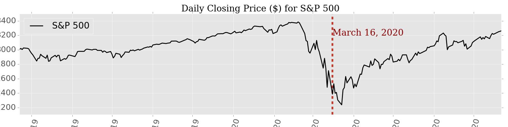
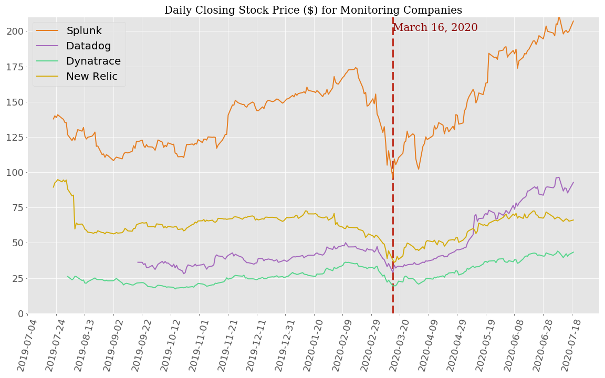
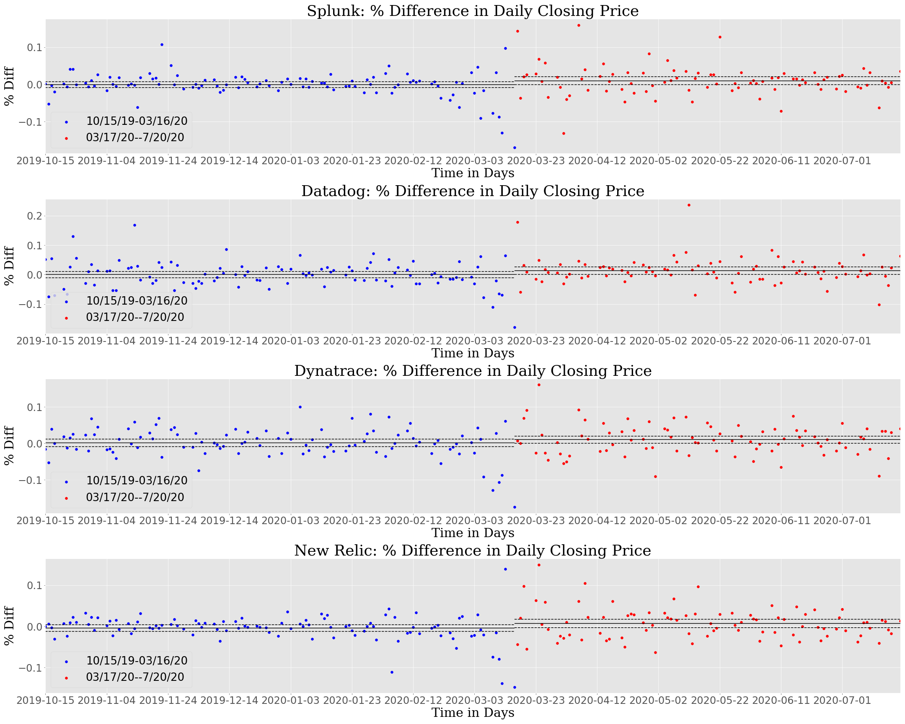
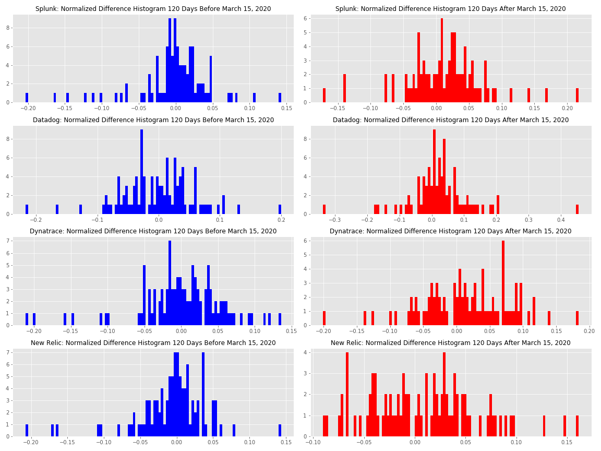
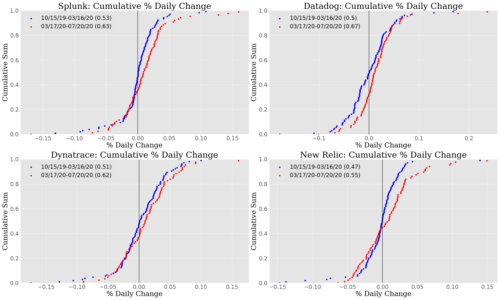

# Statistical Assessment of the Impact of Covid-19 on the Stock Performance for Four Large Application Monitoring Companies 

## Objective

This capstone aims to analyze the relative stock performances of Big 3 monitoring companies ([Splunk](https://www.splunk.com/), [Datadog](https://datadoghq.com), [New Relic](https://newrelic.com/), [Dynatrace](https://www.dynatrace.com/)) and explore who is gaining most as we are adjusting to the post-covid world. 

## Introduction

Internet service disruptions, especially site loading delays, 404 erros and others, are a major issue for consumes and enterprises, alike.  With increased footprint of online workplace following <b>Covid</b>, service disruptions have become more frequent and longer. It seems the service monitoring companies are benefiting from this trend, going by their stock performances ([Datadog Stock](https://www.google.com/search?tbm=fin&sxsrf=ALeKk00Ihr9BF2iwnPYR-HqMNTVyx-xqMQ:1595036432459&q=NASDAQ:+DDOG&stick=H4sIAAAAAAAAAONgecRowS3w8sc9YSn9SWtOXmPU5OIKzsgvd80rySypFJLmYoOyBKX4uXj10_UNDTNSKpMsyo0reRax8vg5Brs4BlopuLj4uwMAvo1YEEwAAAA&sa=X&ved=2ahUKEwjejdff1dXqAhX5CTQIHYeeCUcQ3ecFMAB6BAgnEBM&biw=1920&bih=969&dpr=2#scso=_KlMSX_WfFJ2_0PEP_rSr2Ak1:0&wptab=OVERVIEW), [New Relic Stock](https://www.google.com/search?biw=1920&bih=969&tbm=fin&sxsrf=ALeKk01RFyfTYoHCK3bc7KJ4UJvf-grQQA%3A1595036458339&ei=KlMSX_WfFJ2_0PEP_rSr2Ak&stick=H4sIAAAAAAAAAONgecRowS3w8sc9YSn9SWtOXmPU5OIKzsgvd80rySypFJLmYoOyBKX4uXj10_UNDZOSTYuzCpOKeQCmvyz6PQAAAA&q=NYSE%3A+NEWR&oq=New+relic&gs_l=finance-immersive.1.0.81l2.56294.67618.0.68967.17.17.0.0.0.0.152.1688.6j10.16.0....0...1.1.64.finance-immersive..1.15.1588.0...0.q_WU8NmPGHA#scso=_cFMSX9HUHKSx0PEPxNyJoAY1:0), [Dynatrace Stock](https://www.google.com/search?biw=1920&bih=969&tbm=fin&sxsrf=ALeKk016Zg4oPACGZBdo5bIm4c0oHp93Mg%3A1595036528477&ei=cFMSX9HUHKSx0PEPxNyJoAY&q=NYSE%3A+DY&oq=NYSE%3A+DY&gs_l=finance-immersive.3..81l3.41202.43033.0.43381.6.6.0.0.0.0.112.586.3j3.6.0....0...1.1.64.finance-immersive..0.6.584....0.VHJFwHMrLNo#scso=_nVMSX5uOBZLV9AOtpb2IDw1:0)). 

## Data 

I am intending to scrap internet to compile stock prices for monitoring solutions.  

## Data Analysis

|           |               |     Splunk    |     Datadog   |   Dynatrace   |   New Relic  | 
|-----------|:-------------:|:-------------:|:-------------:|:-------------:|--------------|
|Before/On  | Mean          |  -0.228    |  -0.039    |   0.008   |  -0.222   |
|3/16/20    | Std. Dev.     |   4.612    |   1.699    |    1.101   |   1.781   |
|           | Std. Error    |0.45|0.166|0.107|0.174|
|After      | Mean          |1.28|0.733|0.275|0.326|
|3/16/20    | Std. Dev.     |5.582|2.727|1.263|1.983|
|           | Std. Error    |0.598|0.292|0.135|0.213

## Hypothesis Analysis

* My null hypothesis (H0) is that Covid does <b>not</b> have any impact on the stock prices of Big 3 monitoring comapnies. 
* My alternative hypothesis (H1) is that Covid does have impact on the stock prices of Big 3 monitoring comapnies. 

|               |     Splunk    |     Datadog   |   Dynatrace   |   New Relic  | 
| ------------- |:-------------:|:-------------:|:-------------:|--------------|
| t_stat        |  -2.014599    |  -2.298923    |   -1.544077   |  -1.998822   |
| p_value       |   0.045554    |   0.023007    |    0.124407   |   0.047177   |

## Conclusion

*  Answer if Covid indeed affected stock prices of Big 3 monitoring companies.
*  Answer who is gaining most among the Big 3.

---
## OKR

~~July 20: Collect data~~
~~July 21: Data reading and basic EDA~~
* July 22: Complete EDA and start hypothesis testing
* July 23: Complete hypothesis testing
* July 24: Refinement and Presentation

